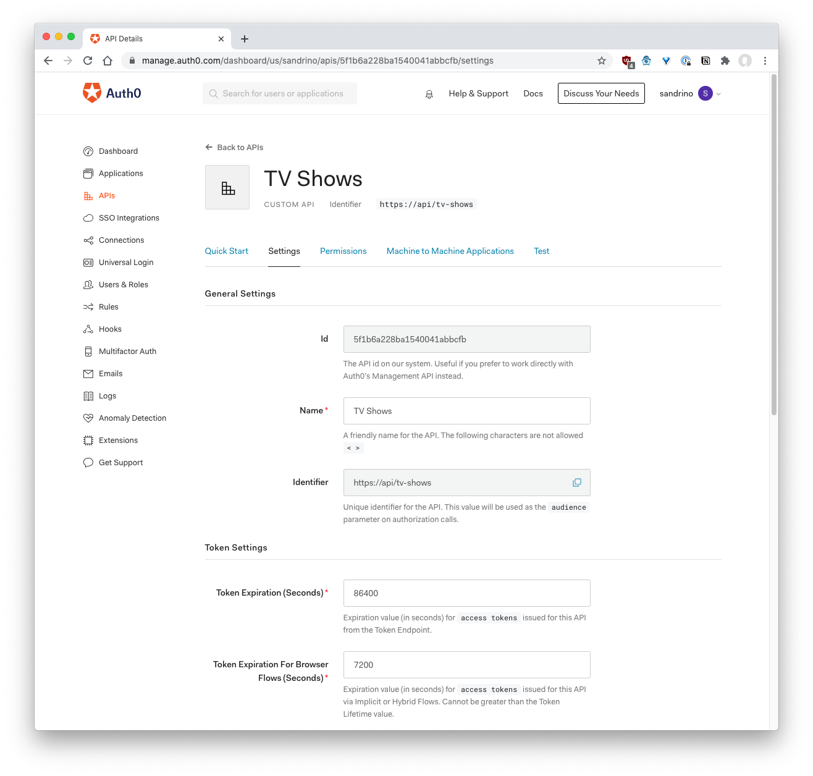
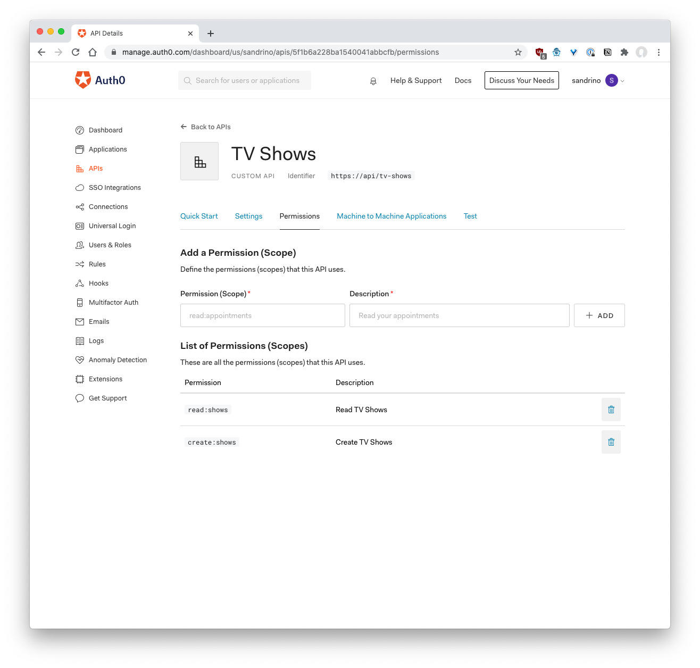
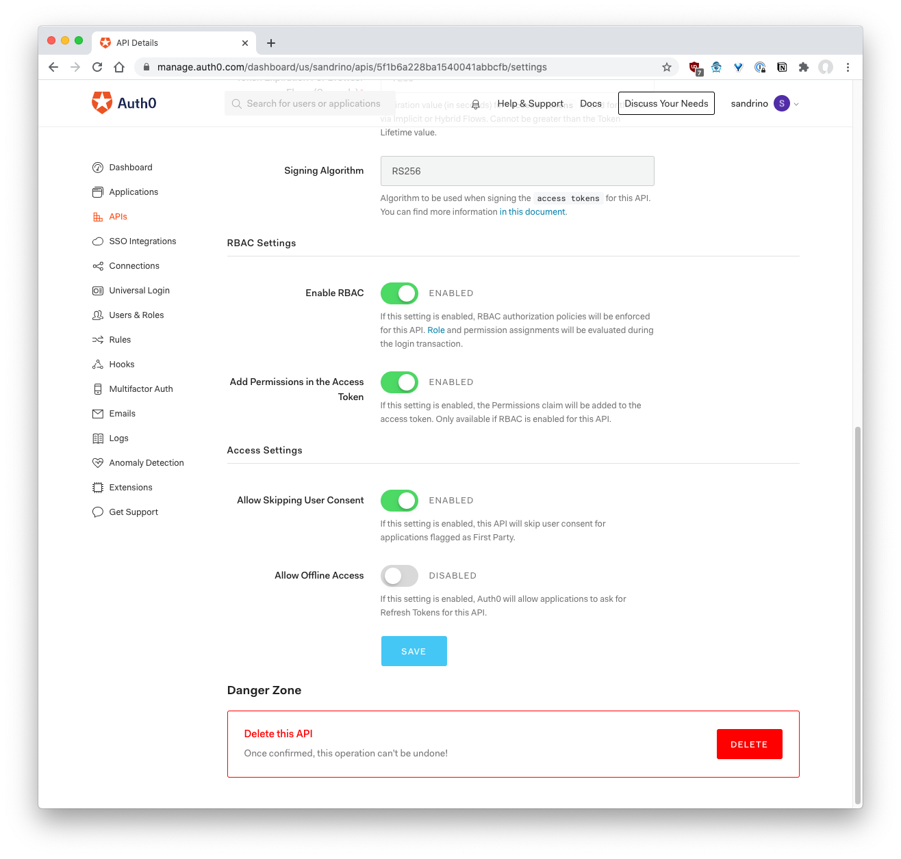
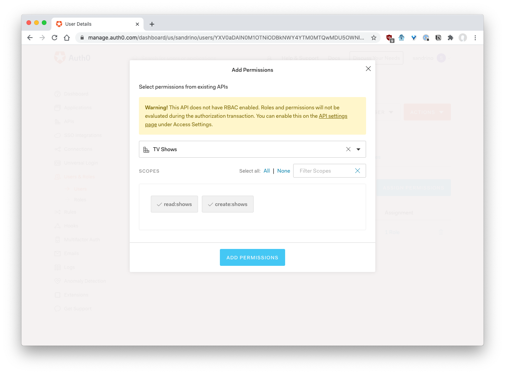
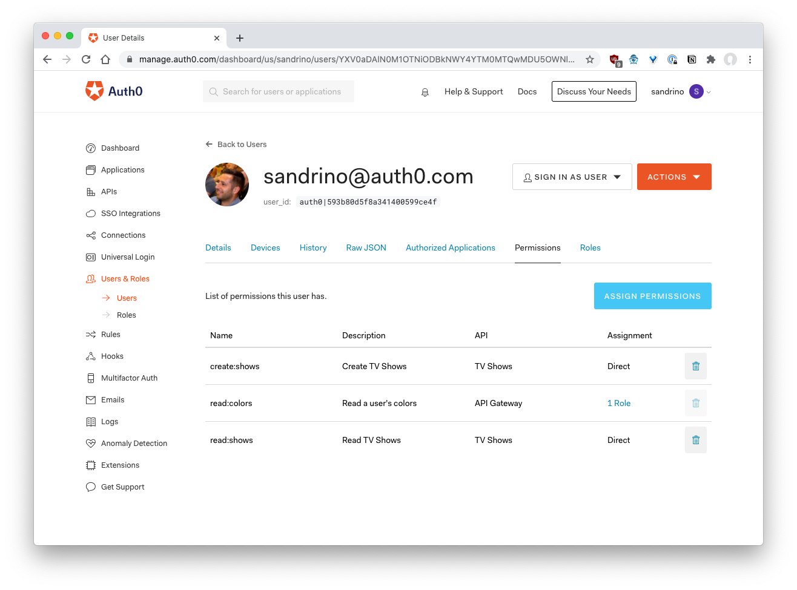

# Auth0

In Auth0 you'll want to create an API which represents your Serverless functions:



The identifier is what you'll configure as the `audience` and your Auth0 domain is what you'll configure as the issuer (either `you.auth0.com` or your Auth0 Custom Domain).

For example:

```js
const jwt = NextJwtVerifier({
  issuer: 'https://sandrino-dev.auth0.com/',
  audience: 'https://api/tv-shows'
});
```

## Scopes

When you configure your JAMstack application you'll probably use one of the Auth0 SDKs. The following example shows how you would configure the React SDK:

```js
<Auth0Provider
  domain={process.env.GATSBY_AUTH0_DOMAIN}
  clientId={process.env.GATSBY_AUTH0_CLIENT_ID}
  audience={process.env.GATSBY_AUTH0_AUDIENCE}
  scope={'openid profile email read:shows create:shows'}
  redirectUri={window.location.origin}
  onRedirectCallback={onRedirectCallback}
>
  ...
</Auth0Provider>
```

The last two scopes define what the application is allowed to do on the user's behalf when talking to the API (the Serverless functions).

These scopes can be configured on your API in Auth0:



## Enabling Authorization Policies

By default a client can request any scope for any user. However, you can enable the RBAC policy to enforce that only users with the right roles or permissions are allowed to receive those scopes.



> Note: if you enable the "Add Permsissions in the Access Token" setting, the access token will contain an additional `permissions` claim with all of the permissions this user has.

You can then go ahead and assing those permissions to a role or to a user directly:





## Enforcing Authorization

Finally, you can use this infromation to enforce authorization in your Serverless functions. By default `@serverless-jwt` will validate the JWT, but you can extend this and implement your own logic.

For example, here's how you would enforce the presence of a certain scope:

```js
const { NetlifyJwtVerifier, removeNamespaces, claimToArray } = require('@serverless-jwt/netlify');

const json = (statusCode, body) => {
  return {
    statusCode,
    headers: {
      'Content-Type': 'application/json'
    },
    body: JSON.stringify(body)
  };
};

const verifyJwt = NetlifyJwtVerifier({
  issuer: process.env.JWT_ISSUER,
  audience: process.env.JWT_AUDIENCE
});

const requireScope = (scope, handler) =>
  verifyJwt(async (event, context, cb) => {
    const { claims } = context.identityContext;

    // Require the token to contain a specific scope.
    if (!claims || !claims.scope || claims.scope.indexOf(scope) === -1) {
      return json(403, {
        error: 'access_denied',
        error_description: `Token does not contain the required '${scope}' scope`
      });
    }

    // Continue.
    return handler(event, context, cb);
  });

exports.handler = requireScope('read:shows', async (event, context) => {
  // Will only execute if the scope is present.
});
```
